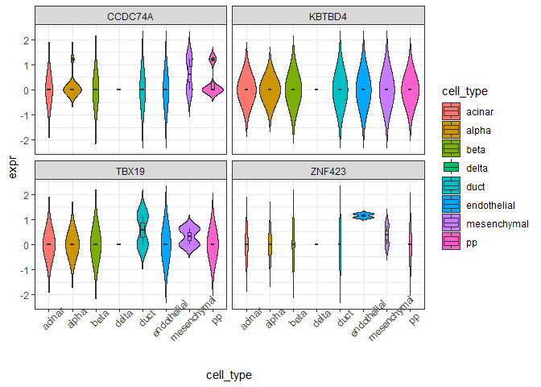
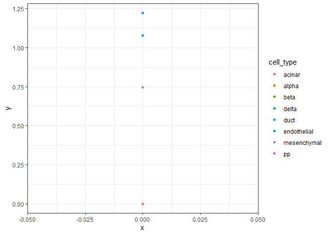

<!-- README.md is generated from README.Rmd. Please edit that file -->

# gepabds

<!-- badges: start -->

<!-- badges: end -->

The goal of gepabds is to provide tools for analyzing and visualizing
gene expression patterns in single-cell RNA-seq data. It enables
per-group expression summaries, gene specificity scoring, and
visualization of marker genes using datasets.

## Installation

You can install the development version of gepabds from
[GitHub](https://github.com/) with:

``` r
install.packages("remotes")
#> Installing package into 'C:/Users/mvijayan/AppData/Local/R/win-library/4.5'
#> (as 'lib' is unspecified)
#> package 'remotes' successfully unpacked and MD5 sums checked
#> 
#> The downloaded binary packages are in
#>  C:\Users\mvijayan\AppData\Local\Temp\Rtmpe0TRJx\downloaded_packages
remotes::install_github("lvmedha/gepabds")
#> Using GitHub PAT from the git credential store.
#> Downloading GitHub repo lvmedha/gepabds@HEAD
#> These packages have more recent versions available.
#> It is recommended to update all of them.
#> Which would you like to update?
#> 
#> 1: All                         
#> 2: CRAN packages only          
#> 3: None                        
#> 4: S7 (0.2.1 -> 0.2.1-1) [CRAN]
#> 
#> S7 (0.2.1 -> 0.2.1-1) [CRAN]
#> Skipping 4 packages not available: SummarizedExperiment, SingleCellExperiment, scuttle, scRNAseq
#> Installing 1 packages: S7
#> Installing package into 'C:/Users/mvijayan/AppData/Local/R/win-library/4.5'
#> (as 'lib' is unspecified)
#> 
#>   There is a binary version available but the source version is later:
#>    binary  source needs_compilation
#> S7  0.2.1 0.2.1-1              TRUE
#> installing the source package 'S7'
#> Warning in i.p(...): installation of package 'S7' had non-zero exit status
#> ── R CMD build ────────────────────────────────────────────────────────────────────────────────────────────
#>          checking for file 'C:\Users\mvijayan\AppData\Local\Temp\Rtmpe0TRJx\remotesa24830b115da\lvmedha-gepabds-525cb12/DESCRIPTION' ...  ✔  checking for file 'C:\Users\mvijayan\AppData\Local\Temp\Rtmpe0TRJx\remotesa24830b115da\lvmedha-gepabds-525cb12/DESCRIPTION' (718ms)
#>       ─  preparing 'gepabds':
#>    checking DESCRIPTION meta-information ...     checking DESCRIPTION meta-information ...   ✔  checking DESCRIPTION meta-information
#>       ─  checking for LF line-endings in source and make files and shell scripts (577ms)
#>   ─  checking for empty or unneeded directories
#>       ─  building 'gepabds_0.0.0.9000.tar.gz'
#>      
#> 
#> Warning: package 'gepabds' is in use and will not be installed
```

``` r
library(gepabds)
library(SingleCellExperiment)

data(example_se)

# safe genes
genes <- rownames(example_se)[1:4]

# 1. Expression statistics
stats <- compute_expr_stats(example_se, genes)
head(stats)
#>     gene   cell_type mean_expr median_expr detection_rate n_cells
#> 1 KBTBD4 mesenchymal         0           0              0       2
#> 2 KBTBD4        beta         0           0              0       3
#> 3 KBTBD4      acinar         0           0              0       6
#> 4 KBTBD4          pp         0           0              0       4
#> 5 KBTBD4       alpha         0           0              0      10
#> 6 KBTBD4 endothelial         0           0              0       2

# 2. Gene specificity
spec <- compute_gene_specificity(example_se, genes)
spec
#>      gene gini_score   top_group  top_mean
#> 2  ZNF423  0.8138737 endothelial 1.1493168
#> 4   TBX19  0.7869893        duct 0.5766949
#> 3 CCDC74A  0.7427944 mesenchymal 0.6169727
#> 1  KBTBD4  0.0000000      acinar 0.0000000

# 3. Long-format data
expr_long <- build_expr_long(example_se, genes)

# 4. Plots
plot_violin(expr_long)
#> Warning: Groups with fewer than two datapoints have been dropped.
#> ℹ Set `drop = FALSE` to consider such groups for position adjustment purposes.
#> Groups with fewer than two datapoints have been dropped.
#> ℹ Set `drop = FALSE` to consider such groups for position adjustment purposes.
#> Groups with fewer than two datapoints have been dropped.
#> ℹ Set `drop = FALSE` to consider such groups for position adjustment purposes.
#> Groups with fewer than two datapoints have been dropped.
#> ℹ Set `drop = FALSE` to consider such groups for position adjustment purposes.
```



``` r
plot_scatter(example_se, genes[1], genes[2])
```



## Example Data

This package includes a subset of the Muraro human pancreas single-cell
RNA-seq dataset (`example_se`) for testing purposes.
